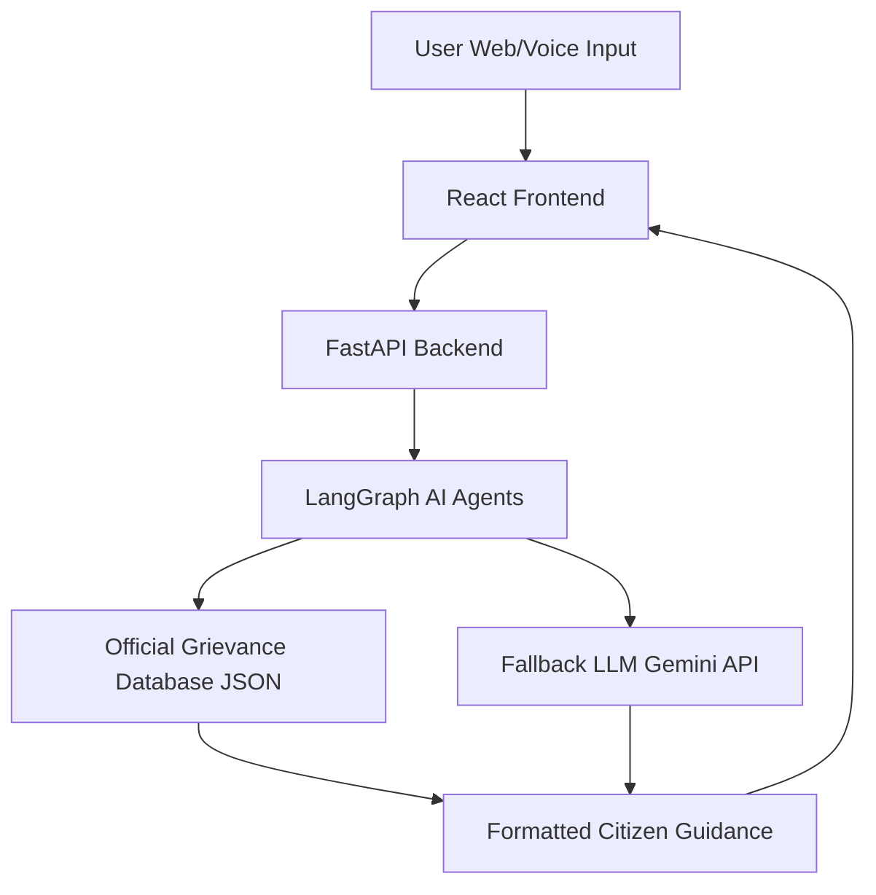

# 🏛️ Citizen Rights & Grievance Navigator AI

<div align="center">


**An AI-powered civic assistant that helps Indian citizens understand their rights, file grievances, and navigate official government complaint systems.**

[🚀 Live Demo](https://citizens-rights-navigator.vercel.app/) • [📖 Documentation](#local-setup) 

</div>

---

## 🌟 Overview

The **Citizen Rights & Grievance Navigator AI** is a bilingual (English & Hindi) civic assistant that empowers Indian citizens to navigate complex bureaucratic processes with confidence. Using AI-driven guidance and an extensive official grievance database, it provides step-by-step instructions, timelines, and escalation paths for various civic issues.

### ✨ Key Features

- 🗣️ **Voice Input Support** - Speak your grievance naturally
- 🌐 **Bilingual Interface** - Seamless English & Hindi support
- 📋 **Structured Guidance** - Step-by-step official procedures
- ⏱️ **Timeline Tracking** - Know when to expect resolution
- 📞 **Official Resources** - Direct portal links & helpline numbers
- 🤖 **Smart AI Fallback** - Handles queries beyond the database
- 📱 **Mobile Responsive** - Access from any device

---

## 🎯 Problem Statement

### The Challenge

Most Indian citizens face significant barriers when seeking to exercise their rights:

| **Challenge** | **Impact** |
|--------------|------------|
| **Lack of Awareness** | Citizens don't know where to file complaints or which department handles their issue |
| **Information Gap** | Required documents, timelines, and procedures are unclear |
| **No Escalation Path** | When grievances are ignored, citizens don't know next steps |
| **Language Barriers** | Official portals often lack vernacular support |

### The Consequences

- 😤 Citizen frustration and disempowerment
- 💰 Increased vulnerability to corruption
- ⏰ Unnecessary delays in resolution
- 📉 Erosion of trust in public institutions

---

## ✅ Our Solution

This project provides an intelligent assistant that:

```
🔍 Identifies grievance category automatically
📝 Provides step-by-step official processes
⏰ Shows realistic timelines & escalation paths
🔗 Links directly to official portals & helplines
🗣️ Works in both Hindi & English
🎤 Supports voice input for accessibility
📊 Uses verified government data
🤖 Uses AI only when official data is unavailable
```

> ⚠️ **Important**: This is a civic guidance system, not legal advice. Always verify with official sources.

---

## 🏗️ System Architecture



### 🔄 AI Agent Workflow (LangGraph)

```
1. Language Detection → Identify user's language (EN/HI)
2. Query Translation → Normalize to English for processing
3. Query Normalization → Clean and standardize input
4. Intent Detection → Match against database
5. Data Retrieval → Use official data if found
6. LLM Fallback → Generate guidance if no match
7. Response Translation → Return in user's language
8. Output Formatting → Structure for readability
```

---

## 📚 Knowledge Base Coverage

Our structured JSON database includes official procedures for:

<table>
<tr>
<td>

**Government Services**
- 🔌 Electricity & Utilities
- 📄 Passport & Visa
- 🏦 Banking Issues
- 💼 PF/EPF Withdrawals

</td>
<td>

**Legal & Safety**
- 👮 Police Complaints
- 💻 Cyber Fraud
- 🏛️ RTI Applications
- ⚖️ Consumer Rights

</td>
<td>

**Public Services**
- 🏫 Education Disputes
- 🏘️ Municipal Services
- 🚗 Transport/RTO
- 🏥 Healthcare

</td>
</tr>
</table>

### 📋 Each Entry Contains:

- ✅ **Step-by-step procedures**
- ⏰ **Official timelines** (acknowledgment & resolution)
- 🔺 **Escalation paths** (when to escalate & to whom)
- 📄 **Required documents** checklist
- 🌐 **Official portal links**
- 📞 **Helpline numbers** (24/7 support)

---

## 🛠️ Tech Stack

### Backend
```
🐍 Python 3.9+
⚡ FastAPI - High-performance API framework
🤖 LangGraph - AI agent orchestration
🔗 LangChain - LLM integration
✨ Gemini API - Google's LLM for fallback
📊 JSON - Structured knowledge base
```

### Frontend
```
⚛️ React 18+
⚡ Vite - Lightning-fast build tool
🎤 Web Speech API - Voice input
🎨 Modern UI - Responsive card-based design
🌙 Dark mode ready
```

### Deployment
```
☁️ Backend → Render
🌐 Frontend → Vercel
💾 Database → GitHub JSON / Supabase
```

---

## 🚀 Getting Started

### Prerequisites

- Node.js 16+ and npm
- Python 3.9+
- Gemini API key ([Get one here](https://makersuite.google.com/app/apikey))

### 🖥️ Local Setup

#### 1️⃣ Clone the Repository

```bash
git clone https://github.com/yourusername/citizen-rights-navigator.git
cd citizen-rights-navigator
```

#### 2️⃣ Backend Setup

```bash
cd backend

# Create virtual environment
python -m venv venv

# Activate virtual environment
# Windows:
venv\Scripts\activate
# macOS/Linux:
source venv/bin/activate

# Install dependencies
pip install -r requirements.txt

# Create .env file and add your API key
echo "GEMINI_API_KEY=your_api_key_here" > .env

# Run the server
uvicorn app:app --reload
```

Backend will be available at `http://127.0.0.1:8000`

#### 3️⃣ Frontend Setup

```bash
cd frontend

# Install dependencies
npm install

# Run development server
npm run dev
```

Frontend will be available at `http://localhost:5173`

---

## 🧪 Try It Out

### Sample Queries

Test the system with these real-world scenarios:

```
💡 "My electricity bill is very high"
💰 "I lost ₹5000 in cyber fraud"
👮 "Police refused to file FIR"
💼 "My PF withdrawal is delayed"
📄 "Passport application is stuck"
🎓 "College is not refunding my fees"
🏦 "Bank charged wrong fees"
🏘️ "Municipal corporation not cleaning my area"
```

**Pro Tip**: Try voice input by clicking the microphone icon! 🎤

---

## 🌐 Deployment Guide

### Backend (Render)

1. Create new Web Service on [Render](https://render.com)
2. Connect your GitHub repository
3. Configure:
   - **Root Directory**: `backend`
   - **Build Command**: `pip install -r requirements.txt`
   - **Start Command**: `uvicorn app:app --host 0.0.0.0 --port 10000`
4. Add environment variable: `GEMINI_API_KEY`

### Frontend (Vercel)

1. Import project on [Vercel](https://vercel.com)
2. Configure:
   - **Framework Preset**: Vite
   - **Root Directory**: `frontend`
   - **Build Command**: `npm run build`
   - **Output Directory**: `dist`
3. Deploy!

---

## 🛡️ Ethics & Safety Guidelines

We prioritize responsible AI:

| **Principle** | **Implementation** |
|--------------|-------------------|
| ✅ **No Legal Advice** | System provides guidance, not legal counsel |
| ✅ **No Hallucinations** | Official data prioritized; AI only for fallback |
| ✅ **No Fake Portals** | Only verified government links |
| ✅ **Neutral Tone** | Respectful, unbiased language |
| ✅ **Transparency** | Clear when using AI vs. official data |
| ✅ **Privacy** | No personal data stored |

---

## 📊 Evaluation Metrics

System performance is measured across:

- 🎯 **Accuracy**: Correctness of procedures & timelines
- 💬 **Clarity**: Ease of understanding for average citizens
- 🌐 **Language Quality**: Natural Hindi & English output
- 💡 **Usefulness**: Real-world problem-solving capability
- 📈 **Coverage**: Breadth of grievance categories handled

---

## 🗺️ Future Roadmap

- [ ] Add more regional languages (Tamil, Telugu, Bengali)
- [ ] Integration with actual government APIs
- [ ] WhatsApp bot interface
- [ ] Case tracking system
- [ ] Community feedback loop
- [ ] Offline mobile app

---

## 🤝 Contributing

We welcome contributions! Here's how:

1. Fork the repository
2. Create a feature branch (`git checkout -b feature/AmazingFeature`)
3. Commit changes (`git commit -m 'Add some AmazingFeature'`)
4. Push to branch (`git push origin feature/AmazingFeature`)
5. Open a Pull Request

---

## 👨‍💻 Author

**Ritesh Kumar**  
Integrated M.Tech – Geophysics  
Indian Institute of Technology, Roorkee


---

## 📄 License

This project is open for **academic and educational use**. 

For commercial use, please contact the author.

---

## 🙏 Acknowledgments

- Built in support of **UN SDG-16**: Peace, Justice & Strong Institutions
- Data sourced from official government portals
- Powered by Google's Gemini AI
- Special thanks to the open-source community

---

<div align="center">

**Made with ❤️ for the citizens of India**

⭐ Star this repo if you find it helpful!

[Report Bug](https://github.com/yourusername/citizen-rights-navigator/issues) • [Request Feature](https://github.com/yourusername/citizen-rights-navigator/issues)

</div>